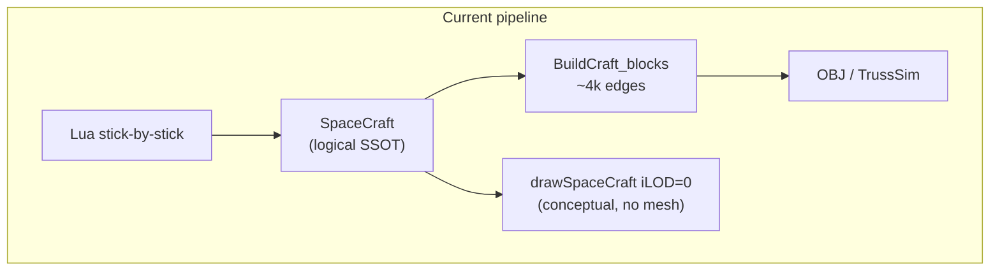
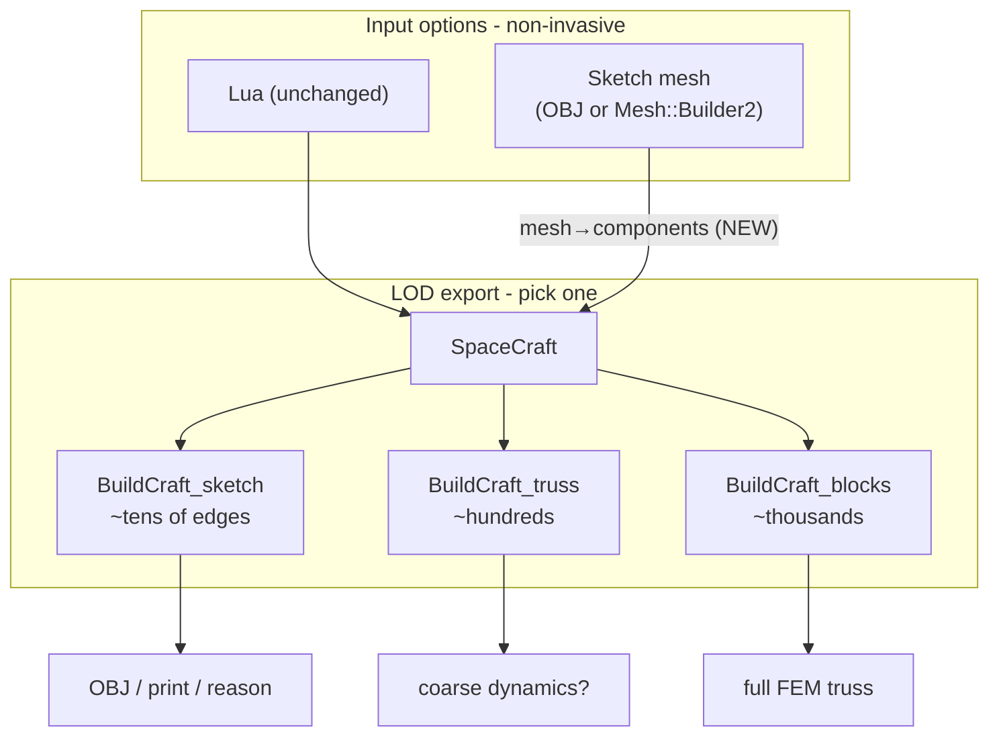

# USER

look at @cpp/common/Orbital/EditSpaceCraft.h @cpp/common/Orbital/SpaceCraftComponents.h @cpp/common/Orbital/SpaceCraft.h 
 @cpp/apps/OrbitalWar/data/ship_ICF_marksman_2.lua 
@cpp/common/Orbital/SpaceCraft2Mesh2.h 

this is system for building spacecraft. Curenly it has certain pipeline from lua to spacecraft to MeshBuilder producing Truss

but for fast conceptual design and better understadning we maybe do now want to go all the way to high-res final truss, maybe we want to generate just conceptual sketch whi lis like low ress mesh where
1) girder are edges between nodes (ore edges split to few segments like poly-line)
2) shields and radiators are polygons (eventually subdivided to few triangles)
3) pusher plates or antena dishes are just triangle fan
4) some other components are just AABB or Cylinder bounding boxes

Souch low res mesh should be easy to visualize print and easy to reason about that the full high-ress truss (which if like finite elements represetation), it is like abstracting out from particular subdivision of finite element simulations, in the final physical realization the shit have concrete numbe of vertexes and tubes forming the truss, but in conceptual desing we may let this decission to later phases

aloso, maybe instead of defining the shit skelet stick-by-stick, girder-by-girder we want to define it direcly like low res mesh where each edge is converted to girder, and faces (polygons) into radiator or shield, not sure if in .obj format is option set this, but we can perhaps use system of materials to define which type of component is which material 

think it throu how to implement this non invasive to current system

there is good chance that it is already to large part implemented so look first what is availabel (rule is inventory first)

lot of documentation is aloso here
/home/prokophapala/git/SimpleSimulationEngine/docs/SpaceCrafting


---

# Cursor Composer 2.5

After inventorying the codebase and docs, a lot of what you want already exists in pieces. The gap is mainly a named **LOD tier** and optional **sketch-as-input** — not a new subsystem from scratch.

## What already exists

### 1. Conceptual visualization (render-only)

`drawSpaceCraft(craft, iLOD=0, …)` in `SpaceCraftDraw.h` already matches your sketch semantics:

| Component | `iLOD=0` (conceptual) | `iLOD>0` (detailed) |
|-----------|----------------------|---------------------|
| Girders/ropes | single line | cylinder strip / truss overlay |
| Rings | circle | (same) |
| Radiators/shields | quad from `plate2quad` | same |
| Tanks | capsule | same |
| Thrusters | parabolic wireframe | extruded wire mesh |

This is the right mental model, but it only draws — it does not produce an exportable `Mesh::Builder2` or OBJ.

### 2. Low-res graph → high-res truss (documented + prototyped)

`docs/TrussGeneration/truss_low_to_hi.md` describes exactly your abstraction:

- **Low-res**: `Mesh::Builder2` verts + typed edges (`w=1` girder, `w=2` rope) + parallel `node_sizes[]`
- **High-res**: `BlockBuilder` → `ConstructionBlockToMeshBuilder::drawBlockBuilder`

`constructionBlockApp.cpp` has a working demo (`-skelet`): 7 nodes + 6 girder edges + 12 rope edges → `skelet.obj` (edges only) → `trussFromSkelet()` → full truss. That pipeline is **not yet wired into `SpaceCraft`**.

### 3. Three mesh builders from the same `SpaceCraft`

```510:596:cpp/common/Orbital/SpaceCraft2Mesh2.h
void BuildCraft_truss( Builder2& mesh, SpaceCraft& craft, double max_size=-1 ){
    // nodes → single verts; girders → girder1(nseg); rings, ropes, radiators, welds
    ...
}
void BuildCraft_blocks( Builder2& mesh, SpaceCraft& craft, double max_size=-1, double node_scale=1.0 ){
    // nodes → octahedron CMesh blocks; girders → bridgeFacingPolygons (HIGH-RES)
    ...
}
```

Plus a simplified standalone variant in `SpaceCraft2Mesh_blocks.h` (nodes as bare verts, no block meshes).

Current default export (`spaceCraftMeshExport`) calls `BuildCraft_blocks` → ~1271 verts / 4268 edges for marksman — that is the **fine FEM truss**, not a sketch.

### 4. OBJ I/O (partial)

`Mesh::Builder2::read_obj` / `write_obj` handle `v`, `f` (fan-triangulated), and `l` (polyline edges). **No `usemtl` / `mtllib` parsing** — material→component mapping is not implemented.

### 5. Plate geometry from logical model

`SpaceCraft::plate2quad()` and `toRayTracer()` already fan-triangulate radiator/shield quads — the triangle-fan pattern you described for dishes is the same idea (`drawUV_Parabola` for thrusters).

## The architectural gap

You have two orthogonal concerns that are currently conflated:



What you want:



## Recommended non-invasive implementation

### Phase A — `BuildCraft_sketch` (smallest win, zero Lua changes)

Add a fourth builder alongside the existing three, in `SpaceCraft2Mesh2.h`:

```cpp
void BuildCraft_sketch(Builder2& mesh, SpaceCraft& craft) {
    // nodes  → mesh.vert(pos)  [1 vert per Node, skip bound nodes]
    // girders/ropes → mesh.edge(i0,i1, stickType)  [NO girder1 subdivision]
    // rings  → closed polyline of nseg≈8-16 (not full wheel truss)
    // plates → 1 quad → 2 tris via plate2quad
    // tanks  → cylinder bbox (2 circles + 4 side edges) or AABB from pose+span
    // thrusters → triangle fan of parabola (reuse drawUV logic, ~8 segments)
    // guns/rocks/balloons → AABB from pose+span
}
```

Wire it as `-lod sketch|truss|blocks` in `spaceCraftMeshExport` and a GUI toggle. **Default stays `blocks`** — nothing breaks.

This reuses:
- `node_to_mesh` (already 1 vert per free node)
- `plate2quad` + `mesh.addQuad` / fan triangulation
- `ComponetKind` for edge/face typing in `mesh.edges[i].w`

For marksman, you'd get ~7 nodes + ~10 girders + ~20 ropes + 2 ring polylines + 1 thruster fan ≈ **~50–100 edges** instead of 4268.

### Phase B — Formalize low-res graph as intermediate representation

Align with `truss_low_to_hi.md`:

```cpp
struct SpaceCraftSketch {
    Mesh::Builder2 graph;          // verts + typed edges + optional face chunks
    std::vector<double> node_sizes;
    // optional: chunks for plate polygons
};

SpaceCraftSketch toSketch(const SpaceCraft&);     // NEW - inverse of BuildCraft_sketch
void fromSketch(SpaceCraft& craft, const SpaceCraftSketch&);  // for round-trip
void sketchToBlocks(const SpaceCraftSketch&, Builder2& hi);  // wraps trussFromSkelet
```

`BuildCraft_sketch` = `toSketch` materialized to triangles for export.  
`BuildCraft_blocks` = `sketchToBlocks(toSketch(craft))` — existing path preserved.

### Phase C — Sketch-as-input (OBJ or Lua)

**Option 1 — OBJ with materials** (your idea):

```
# ship_sketch.obj
mtllib ship_sketch.mtl
usemtl girder_steel
l 1 2
l 2 3
usemtl rope_kevlar  
l 1 4
usemtl shield
f 10 11 12 13
usemtl radiator
f 20 21 22 23
usemtl thruster
f 30 31 32   # fan from center 30
```

Extend `read_obj` to track current `usemtl`; add:

```cpp
void sketchFromOBJ(const char* path, SpaceCraftWorkshop& shop, SpaceCraft& craft);
```

Mapping table (in `.mtl` or a sidecar JSON):

| MTL prefix | Action |
|------------|--------|
| `girder_*` | `make_Girder` between edge endpoints |
| `rope_*` | `make_Rope` |
| `shield` / `radiator` | `add_Shield` / `add_Radiator` from face vertices (needs 2 spanning edges or 4 corners) |
| `tank` / `thruster` | `add_Tank` / `add_Thruster` from face fan center + radius |
| `node` | explicit `Node` at vertex |

**Option 2 — Lua sketch API** (fits existing `EditSpaceCraft.h`):

```lua
-- instead of 80-segment girders:
SketchEdge(n0, nFw, "girder_steel")
SketchFace({nA,nB,nC,nD}, "shield")
SketchVolume({pos, rot, span}, "thruster", "ICF_nozzle")
```

Internally these call the same `SpaceCraft` factories but with `nseg=1` defaults.

### Phase D — Simulation coupling (defer)

| LOD | Dynamics use |
|-----|--------------|
| sketch | mass/inertia estimates, radiosity proxies (AABB clusters), combat hitboxes |
| truss | coarse structural modes |
| blocks | full `TrussDynamics_d` |

`exportSimToFile` already works on any `Mesh::Builder2` — sketch LOD would produce a much smaller `.truss` for fast iteration. No change to `TrussDynamics_d` import.

## What NOT to do

1. **Don't replace `SpaceCraft` as SSOT** — keep components + `build_order`; sketch is a view/import format, not a parallel model.
2. **Don't merge into `BuildCraft_blocks`** — resolution must be an explicit switch; subdivision decisions belong in later phases.
3. **Don't require OBJ** — `BuildCraft_sketch` from existing Lua (marksman) works immediately with zero script changes.
4. **Don't duplicate `drawSpaceCraft`** — factor shared geometry (`plate2quad`, parabola fan, AABB) into a `SpaceCraftSketchGeom.h` used by both draw and mesh export.

## Immediate next steps (ordered by value/risk)

1. **Implement `BuildCraft_sketch`** + `-lod sketch` in `spaceCraftMeshExport` — validate on marksman: expect ~50–100 edges vs 4268.
2. **Compare visually**: sketch OBJ in MeshViewer vs `drawSpaceCraft(iLOD=0)` screenshot — should match topology.
3. **Extract `toSketch()`** as the canonical low-res graph (feeds `truss_low_to_hi` path).
4. **Add `usemtl` to `read_obj`** + minimal `sketchFromOBJ` for hand-authored sketches.
5. **Document** in `docs/SpaceCrafting/` as LOD tier table (sketch / truss / blocks).

## Summary

| Your requirement | Status |
|------------------|--------|
| Edges → girders (polyline OK) | `node_to_mesh` + bare `edge()` exists; not wired as export tier |
| Faces → shields/radiators | `plate2quad` + fan tri exists |
| Dish → triangle fan | `drawUV_Parabola` exists; not in mesh builder |
| Volumes → AABB/cylinder | `drawCapsula`, `toBuckets`; not in mesh builder |
| Low-res mesh as design abstraction | Documented in `truss_low_to_hi.md`; prototyped in `constructionBlockApp` |
| OBJ + materials | `read_obj` exists; no material parsing |
| Non-invasive | Add `BuildCraft_sketch` + LOD flag; `SpaceCraft` / Lua unchanged |

The system is ~70% there: conceptual **drawing** (`iLOD=0`), low→high **docs + demo**, and **medium/high mesh builders** all exist. The missing piece is a named **`BuildCraft_sketch` export path** and optionally **sketch→SpaceCraft import** for defining ships as meshes instead of stick lists.

If you want to proceed, Phase A (`BuildCraft_sketch` + CLI flag) is the right first slice — small diff, immediately useful for marksman and other Lua ships, and it does not touch the high-res pipeline.

---

# USER

OK, I agree with you that the SpaceCraft shoud be central representation which hold old information. We have different ways how to build SpaceCraft and different LODs to output form it. This decouples generation (design) from simulation (rendering, Truss mechanis/dynamics, raycasting, radiosity, radiation ray scattering, collision detection ...). The SpaceCraft should be able to  to export both low res and high res obj (LOD).

now interaction of lua and obj as input (way of building spacecraft)
I think it would be good if we can use .obj not just as an alternative to lua script but also as part of lua script. For example from lua we can call something like "fromObj" which will create girder and radiators which we can furher supplement or modify (move control points, scale, rotate ...), it should be also possible to have pieces of .obj format direcly inside lua script as multipline string literals in-place,m the system does not have to be perfect and provide all specification from start

now analyse where are the gaps problems/roadblockes to implementing this
 

---

# Cursor Composer 2.5

Here is a gap and roadblock analysis mapped to the actual codebase, organized by subsystem.

## Target architecture (agreed)

```
Inputs                    SpaceCraft (SSOT)              Outputs (LOD)
─────────                 ─────────────────              ─────────────
Lua procedural     ──┐
fromObj("hull.obj") ─┼──►  nodes, girders, plates, ...  ──► BuildCraft_sketch  → sketch.obj
fromObjString([[...]])─┘                                 ──► BuildCraft_blocks  → full.obj
Lua supplements (Girder, Thruster, …)                    ──► exportSimToFile    → .truss
```

Most of the **right side** is partially there; the **left side** and **LOD switch** are not.

## Gap 1: LOD export does not exist yet

| Item | Status | Roadblock |
|------|--------|-----------|
| `BuildCraft_sketch` | **Missing** | Not implemented anywhere |
| `-lod` flag in CLI | **Missing** | `spaceCraftMeshExport` always calls one builder |
| `drawSpaceCraft(iLOD=0)` | **Exists** | Render-only; no `Mesh::Builder2`, no OBJ |
| `write_obj` round-trip | **Partial** | Writes `v`, `f`, `l`; no `usemtl`, no edge type in `e.w` |

**Concrete problem:** `spaceCraftMeshExport.cpp` hardcodes `BuildCraft_blocks` and includes `SpaceCraft2Mesh_blocks.h`, not `SpaceCraft2Mesh2.h`:

```40:40:cpp/apps/OrbitalWar/spaceCraftMeshExport.cpp
    BuildCraft_blocks( mesh, *theSpaceCraft, 30.0 );
```

That header’s `BuildCraft_blocks` is a **simplified truss path** (no octahedron blocks, no sliders). Dynamics apps use the **full** `SpaceCraft2Mesh2.h` version. So CLI export and simulator mesh build are already inconsistent — adding LOD on top of this without unifying builders first will multiply confusion.

**Roadblock severity:** Medium — need one canonical `BuildCraft_*` API surface + LOD dispatch before OBJ export is trustworthy.

## Gap 2: No mesh → SpaceCraft import path

| Item | Status | Roadblock |
|------|--------|-----------|
| `Mesh::Builder2::read_obj` | **File only** | `fopen(fname)` — no string/buffer input for inline Lua literals |
| `usemtl` / `g` / `o` parsing | **Missing** | Only `v`, `vn`, `vt`, `f`, `l` |
| `sketchFromOBJ` / `fromObj` | **Missing** | No code in `EditSpaceCraft.h` or `SpaceCraft.h` |
| Mesh → component factory | **Missing** | No function maps edges/faces to `Girder`, `Radiator`, etc. |

**For `fromObj("path.obj")` in Lua:** trivial wrapper once core import exists — register `l_fromObj` in `initSpaceCraftingLua()`.

**For inline multiline OBJ in Lua:**

```lua
fromObjString([[
v 0 0 0
v 10 0 0
usemtl girder_steel
l 1 2
]])
```

Needs:
1. `read_obj_from_string(const char* buf, size_t len)` — refactor `read_obj` to share a line parser (or temp file — ugly but works for v0).
2. Lua: `lua_tolstring(L, 1, &len)` — no new Lua dependency; `loadstring` for OBJ is unnecessary.

**Roadblock severity:** High for import — this is the main greenfield work.

---

## Gap 3: Semantic mismatch — OBJ geometry vs SpaceCraft model

This is the deepest design problem. `SpaceCraft` is **not** a generic mesh; components have typed semantics and dependencies.

### 3a. Plates require two girders, not four corners

```689:693:cpp/common/Orbital/SpaceCraftComponents.h
class Plate : public ShipComponent { public:
    int g1,g2;    // anchor girders
    Vec2d g1span; // pos along girdes
    Vec2d g2span;
```

`plate2quad` spans between **two girder centerlines** with parametric spans — not an arbitrary quad in space.

**OBJ face `f 1 2 3 4`** gives 4 vertices. To make a `Shield`/`Radiator` you must either:
- Infer two opposite edges as “girder directions” and create/find girders along them, or
- Add a new component type, e.g. `SketchPlate` with 4 explicit `Node*` corners (bypasses girder-span model), or
- Store face as mesh-only metadata until high-res build (loses radiosity/combat integration that expects `Plate`).

**Roadblock:** Without a v0 rule (“quad face → 4 nodes + 2 synthetic girders on diagonals” or “face stored as `SketchFace` stub”), shield/radiator import will be ambiguous or wrong.

### 3b. Girders need more than two endpoints

`make_Girder` requires `up`, `nseg`, `mseg`, `wh`, stick material quad `st`:

```264:277:cpp/common/Orbital/EditSpaceCraft.h
int l_Girder  (lua_State * L){
    ...
    int id = theSpaceCraft->make_Girder(node1_id, node2_id, up, nseg, mseg, wh, mat_name, st);
```

OBJ edge `l 1 2` gives only topology. Defaults are fine for sketch LOD (`nseg=1`, `wh` from material map), but **`up` is undefined** for arbitrary edges — affects `girder1` cross-section orientation and block bridging.

**Mitigation for v0:** auto-`up` = arbitrary orthonormal (e.g. `getSomeOrtho(edge_dir)`), document that imported girders may have arbitrary roll until user fixes in Lua.

### 3c. Vertex deduplication and identity

OBJ `l 1 2` and `l 2 3` share vertex 2. Import must:
- Maintain `obj_vert_index → SpaceCraft Node id` map
- Weld coincident positions (OBJ often has duplicate `v` at same location)
- Handle polyline `l 1 2 3 4` → either one girder with internal points (not supported — girders are 2-node) or split into chained girders sharing nodes

**Roadblock:** Polylines need explicit policy: **split into segment girders** (simplest, matches current `NodeLinker` model).

### 3d. Material → component mapping

`read_obj` ignores `usemtl`. You need a sidecar convention, e.g.:

| MTL name pattern | Creates |
|------------------|---------|
| `girder_*` | `Girder` + default `StickMaterial` |
| `rope_*` | `Rope` |
| `shield` | `Shield` (needs girder inference) |
| `radiator` | `Radiator` |
| `thruster` | `Thruster` from face fan / AABB |
| `node` | explicit junction (optional) |

Stick materials must exist in `workshop` before import (`StickMaterial(...)` in Lua preamble) — same as current scripts.

**Roadblock severity:** High for plates/rings; medium for edges-only hull sketches.

## Gap 4: Post-import modification APIs are missing

You want: import OBJ → then move/scale/rotate in Lua.

| Desired op | Status |
|------------|--------|
| Move `Node` | **Possible in C++** (`o->pos = …`) but **no Lua API** |
| Scale whole imported group | **Missing** — no `Group` / `SketchImport` handle |
| Rotate girders/plates | **Missing** — would need transform on node positions + `up`/`pose.rot` |
| Modify after mesh built | **Stale ranges** — `pointRange`/`stickRange` invalid until rebuild |

`Truss::affineTransform` exists for raw truss geometry; nothing equivalent on `SpaceCraft`.

**Roadblock:** Import should return a **handle** (e.g. import group id + list of component ids) so Lua can call:

```lua
grp = fromObj("hull.obj", {scale=10, pos={0,0,0}})
moveGroup(grp, {100,0,0})
```

Without this, users must manually track which `Node` ids came from import — fragile.

**Roadblock severity:** Medium — can defer if v0 is “import at correct scale/position only”; painful for iterative design.

## Gap 5: `build_order` is documented but unused

```82:82:cpp/common/Orbital/SpaceCraft.h
    std::vector<ShipComponent*>  build_order;
```

No `build_order.push_back` anywhere in the codebase. Mesh builders iterate typed vectors (`nodes`, `girders`, …) in fixed passes, not construction order.

**Impact on OBJ+Lua mixing:** If Lua does `fromObj(...)` then `BoundNode(girder, …)`, bound nodes need the girder to exist logically (OK) but mesh attachment needs `pointRange` populated at build time — order matters at **mesh build**, not at **SpaceCraft assembly**. Currently OK for logical model; problematic if you expect incremental mesh updates.

**Roadblock severity:** Low for batch export; high if you want live editor “add piece and see mesh update” without full rebuild.

## Gap 6: Downstream consumers assume high-res mesh ranges

Several systems depend on `pointRange`/`stickRange` after `BuildCraft_blocks`:

| Consumer | Needs |
|----------|--------|
| `Slider::updatePath` / `sideToPath` | Mesh vertex loops on girders/rings (`nseg` match) |
| `sliders2edgeverts` | Anchor `ivert` from `make_anchor_point` |
| `exportSim` / `exportSimToFile` | Edge `e.w` → `stickMaterials` |
| `toRayTracer` / radiosity | `plate2quad` from girder spans |
| `makeBBoxes` / collision | `toBuckets` on structural components |

**Sketch LOD implications:**
- Sketch export for **visualization/print**: fine with bare edges + fan tris
- Sketch → **truss dynamics**: OK if edges carry valid `e.w` stick types
- Sketch → **sliders/rings**: **broken** unless ring/girder mesh ranges match what `sideToPath` expects (hard-coded `n/4` checks that `exit(0)` on mismatch)

**Roadblock severity:** High for simulation on sketch LOD; low for “conceptual OBJ for human review”.

## Gap 7: Duplicate / divergent `BuildCraft_blocks` definitions

Two headers define the same function name with **different behavior**:

| Header | Behavior |
|--------|----------|
| `SpaceCraft2Mesh2.h` | Full blocks: octahedron nodes, `bridgeFacingPolygons`, sliders |
| `SpaceCraft2Mesh_blocks.h` | Simplified: point nodes, `girder1`, no sliders |

Whichever is included last wins (ODR violation risk if both included in one TU). Today they are split across apps, but this blocks clean LOD design.

**Roadblock severity:** High — must consolidate before adding `BuildCraft_sketch` as third variant.

## Gap 8: OBJ export loses semantics

`write_obj` emits geometry only:

```1880:1882:cpp/common/geometry/MeshBuilder2.cpp
        for(const auto& e : edges){ fprintf(pFile, "l %i %i\n", e.x+1, e.y+1); }
```

- No `usemtl` (edge type / component kind lost)
- `e.w` (stick material index) not exported
- No grouping (`g girder_3`)

**Impact:** Export sketch OBJ → re-import → all edges become untyped unless you add MTL on write. Round-trip design ↔ simulation breaks without symmetric import/export.

**Roadblock severity:** Medium — needed for “sketch in Blender, refine in Lua” workflow.

## Gap 9: Incomplete component coverage in mesh builders

Even full `BuildCraft_blocks` in `SpaceCraft2Mesh2.h` has radiators/shields/welds commented out; `BuildCraft_truss` has radiators but not shields.

**Impact:** OBJ import creating shields is useless for high-res export until builders are finished. Sketch LOD could still draw plate quads.

**Roadblock severity:** Medium — parallel track to OBJ import.

## Gap 10: Path / working directory for `fromObj` in Lua

Scripts load via `Lua::dofile` from `data/` (symlinked in tests). Relative OBJ paths depend on **process CWD**, not script directory.

**Roadblock:** `fromObj("hull.obj")` fails unless CWD is right. Need base-path argument or resolve relative to Lua script path (not tracked today).

**Roadblock severity:** Low — fix with `fromObj(path, {base=...})` or document CWD convention.

## Suggested implementation order (minimizes roadblocks)


### v0 scope (avoids hardest roadblocks)

- **Import:** edges/`l` lines only → `Node` + `Girder`/`Rope` via `usemtl` prefix
- **Defaults:** `nseg=1`, auto `up`, `wh` from Lua table or global defaults
- **Input:** file + inline string
- **Export:** `BuildCraft_sketch` + `-lod sketch|blocks`
- **Skip for v0:** plate faces, rings, sliders, round-trip MTL

### v1 scope

- Quad faces → `SketchPlate` (new lightweight component) or girder-pair inference
- `write_obj` emits `usemtl` per component kind
- Import group handle + `transformGroup(grp, pose, scale)`

## Summary table

| Area | Blocker? | Notes |
|------|----------|-------|
| LOD sketch export | Yes — not built | `drawSpaceCraft` is the spec |
| LOD CLI switch | Easy once sketch exists | |
| `read_obj` string input | Easy refactor | |
| `usemtl` parsing | Medium | New parser state |
| Edge → Girder/Rope | Medium | Defaults for `up`, `nseg`, materials |
| Face → Plate | **Hard** | Model wants 2 girders, OBJ gives 4 verts |
| Post-import transform | Medium | No Lua APIs, no group abstraction |
| Round-trip OBJ | Medium | Export must write materials |
| Duplicate `BuildCraft_blocks` | **Yes — fix first** | CLI ≠ dynamics today |
| Simulation on sketch LOD | Hard | `sideToPath` assumes full mesh |
| `build_order` | Latent debt | Unused; matters for incremental mesh |

The **critical path** is: consolidate mesh builders → add `BuildCraft_sketch` + LOD flag → edge-only OBJ import with `usemtl` → Lua `fromObj`/`fromObjString`. Plate semantics and transform APIs can follow without blocking a useful first version for hull wireframe conceptual design.

If you want to move to implementation next, I'd start with builder consolidation + `BuildCraft_sketch` + `-lod` in `spaceCraftMeshExport`, since that unblocks both export directions before touching import.

---

# USER

OK, few notes/clarification and sugested solutuion to some goasl

1) obj should not provide full information to build a this, that is why we combine it wit lua modification. It should be possible to buld shit with some information missing (e.g. numbe of segments/subdivision, up-vectros, wifth of girders... ), setup of this information should be defered.
At least for debug-mode it would be good it we fill these defered infoamtion is initialized to some clarly invalid value (NaN for floats/vectros, -1 for integers like indexes or number of elements)

material should not by real material like steek/kervalr, it should be rather something like girder type, basically a tag or token wich we will later to fullfil the defered parameters setup

2) we do not need full roundtrip (that sphacecraft exported to .obj can be loaded as new spacecraft without information loss), we want to preserve as much infromation as possible but not necessarily all

3) do not try to solve divergence/competing variatnes of  BuildCraft_blocks etc. This is not our responsibilty now. Flag them in the code (write there clear commenrs/warrning/ToDo but do not try to unify them, this would be large refactro which would detrou us from the task)

4) we do not want o run Truss-dyanmics with the Low-res LOD, we may want to run raycasting at some point, but simulation is another task wich we do not need to solve now (but werite comments/todo in the code) 

5)  build_order is very important feature, shich we definitely want o implement soon, but unless we need it now, do not impleent it yet, butwrite commnents/ToDO in the code

---

# Cursor Composer 2.5

With your clarifications, several items from the first analysis drop off the critical path. Here is a tightened second-round read: what is settled, what still needs one design choice, and a concrete plan.

## What your clarifications remove as blockers

| Former concern | Resolution |
|----------------|------------|
| OBJ must supply `up`, `nseg`, `wh`, real materials | **Not required** — import creates incomplete components; Lua fills later |
| Full OBJ round-trip | **Out of scope** — export may emit tags for humans; lossy re-import is OK |
| Unify `BuildCraft_blocks` variants | **Explicitly out of scope** — add TODO comments only |
| Truss dynamics on sketch LOD | **Out of scope** — sketch export is viz/print; no `.truss` from sketch |
| `build_order` | **Deferred** — TODO comments where components are pushed |
| Plate = 2 girders + spans | **Avoided for import** — store face as corner polygon + tag; defer girder attachment |
| `sideToPath` / slider mesh ranges | **Irrelevant** for sketch LOD and for OBJ-only hull import |

The architecture is now straightforward:

```
OBJ (partial topology + usemtl tags)  ──┐
Lua procedural / supplements          ──┼──► SpaceCraft (complete + deferred fields)
                                        │
                    ┌───────────────────┴───────────────────┐
                    ▼                                       ▼
           BuildCraft_sketch                         BuildCraft_blocks*
           (viz, print, debug)                      (sim mesh — existing path)
           * whichever header the app already uses; do not unify now
```

## One design choice still open (recommendation included)

**How to represent imported faces (`f …`) before they become `Shield`/`Radiator`?**

| Option | Pros | Cons |
|--------|------|------|
| **A. New `SketchPolygon` component** (node id list + tag) | Clean; no fake girders; sketch export is trivial | One small new type + vector in `SpaceCraft` |
| **B. Defer on `Plate` with `g1=g2=-1` + corner nodes** | Reuses `Plate` kind | Overloads semantics; `plate2quad` breaks until resolved |
| **C. Mesh-only staging buffer, not in `SpaceCraft`** | No model change | Breaks SSOT; Lua can't reference imported faces by id |

**Recommendation: A — `SketchPolygon`** with `int* cornerNodeIds`, `int nCorner`, `char tag[NAME_LEN]`. Lua later does `resolvePolygon(pid, g1, span1, g2, span2)` → `Shield`/`Radiator`, or sketch LOD draws it directly as a fan.

Everything else can proceed without further architecture debate.

## Deferred-field convention (needs to be defined once)

Add shared sentinels (e.g. in `SpaceCraftComponents.h`):

```cpp
// Deferred / unset — set at OBJ import; must be resolved before high-res mesh + simulation
constexpr int    DEFERRED_I = -1;
constexpr double DEFERRED_F = nan("");  // or a project-wide NaN constant

// Girder after OBJ import:
//   nseg, mseg = DEFERRED_I
//   st.x..st.w = DEFERRED_I
//   face_mat   = DEFERRED_I   (already -1 on ShipComponent)
//   wh         = (DEFERRED_F, DEFERRED_F)
//   up         = (DEFERRED_F, DEFERRED_F, DEFERRED_F)
//   sketchTag  = "girder_main"  (from usemtl — NOT StickMaterial name)
```

`usemtl girder_main` → component kind from **token prefix** (`girder`, `rope`, `shield`, `radiator`, `thruster`, `tank`, …) + remainder stored as `sketchTag` for later `fulfillTag` / per-id Lua calls.

**Existing code touchpoint:** `make_Girder` must not be used on import (it calls `panelMaterials.getId(mat_name)` and expects real params). Import uses `add_Girder` with sentinels + sets `sketchTag` on a new field.

**Guard rails:**
- `BuildCraft_sketch` — uses topology + tag only; ignores NaN/`DEFERRED_I` (draws line between nodes, fans polygon corners).
- `BuildCraft_blocks` / truss export — **skip or fail loud** on deferred components (configurable; default: warn + skip for v0).
- Debug helper: `craft.printDeferred()` lists all unset fields.

No serious roadblock here — just disciplined checks at mesh-build boundaries.

## Remaining minor open questions (not blockers)

1. **Import return value to Lua** — return a table `{nodes={...}, girders={...}, polygons={...}}` from `fromObj` / `fromObjString`? (Recommended: yes, simple table; no `Group` class yet.)

2. **Transform at import** — optional `fromObj(path, {pos, scale, rot})` applied to created nodes before Lua edits? (Recommended: yes in v0; avoids needing `moveGroup` immediately.)

3. **Polyline `l 1 2 3 4`** — split into chained segment girders sharing nodes? (Recommended: yes; matches `NodeLinker` model.)

4. **Vertex welding** — weld OBJ verts within ε at import? (Recommended: optional flag, default off for v0; Blender exports are usually clean.)

5. **OBJ path resolution** — `fromObj("hull.obj")` relative to CWD vs script dir? (Recommended: optional 2nd arg `basePath`; document test convention.)

6. **Export sketch OBJ with `usemtl`** — nice for Blender; not required for round-trip. (Phase 2 optional.)

None of these block starting implementation.

## Implementation plan (ordered, scoped to your constraints)

### Milestone 1 — Sketch LOD export (no import yet)

**Files:** `SpaceCraft2Mesh2.h`, `spaceCraftMeshExport.cpp`, brief note in `docs/SpaceCrafting/`

1. Add `BuildCraft_sketch(mesh, craft)`:
   - Nodes → `mesh.vert`
   - Girders/ropes → single `mesh.edge` (polyline: if you later add intermediate nodes, sketch draws each segment)
   - `SketchPolygon` (if added) or skip plates until M2
   - Rings → low-seg circle polyline (~12)
   - Thrusters/tanks → AABB or triangle fan (copy logic from `drawSpaceCraft` iLOD=0)
2. Add `-lod sketch|blocks` to CLI; **default `blocks`** (unchanged behavior).
3. When `-lod sketch`: do **not** write `.truss` (or error if `-t` passed) — add TODO: raycast mesh source.
4. Add header comments on duplicate `BuildCraft_blocks` in both headers (WARNING/TODO, no refactor).

**Acceptance:** marksman Lua → sketch OBJ ~O(100) edges vs ~4000; MeshViewer looks like wireframe concept.

### Milestone 2 — Deferred sentinels + tag field

**Files:** `SpaceCraftComponents.h`, `SpaceCraft.h`, `EditSpaceCraft.h` (minimal)

1. `char sketchTag[NAME_LEN]` on `ShipComponent` (or `StructuralComponent` only).
2. `DEFERRED_I` / `DEFERRED_F` constants + `bool isDeferred(const Girder&)` helpers.
3. `add_GirderDeferred(node0, node1, tag)` — sets sentinels, stores tag.
4. `printDeferred()` on `SpaceCraft`.
5. TODO comments on `build_order` at every `components.push_back` site.

**Acceptance:** unit-style test: create deferred girder, `printDeferred` lists it, `BuildCraft_sketch` still works, `BuildCraft_blocks` warns/skips.

### Milestone 3 — OBJ import core

**Files:** `MeshBuilder2.cpp/.h`, new `SpaceCraftFromOBJ.h` (or section in `EditSpaceCraft.h`)

1. Refactor `read_obj` → shared line parser; add `read_obj_stream(FILE*)` and `read_obj_string(const char*, size_t)`.
2. Parse `usemtl` (ignore `mtllib` content for v0 — tags inline only).
3. `importOBJToSpaceCraft(Builder2& staging, SpaceCraft& craft, ImportResult& out)`:
   - `v` → ensure `Node` (map obj index → node id)
   - `l` + current tag → `add_GirderDeferred` / `add_RopeDeferred` by prefix
   - optional transform matrix
4. Lua: `fromObj(path [, opts])`, `fromObjString(str [, opts])` → return component id table.

**v0 import scope:** edges only (`l` lines). Faces deferred to M4.

**Acceptance:** Lua script with inline OBJ string + `Girder(...)` supplements builds; sketch export shows both.

### Milestone 4 — Faces + resolve APIs

1. `SketchPolygon` + `usemtl shield_*` / `radiator_*` on `f` lines.
2. `BuildCraft_sketch` fans polygons to tris.
3. Lua resolve helpers (minimal):
   - `setGirderParams(id, {nseg, up, wh, ...})`
   - `setNodePos(id, pos)` 
   - `resolvePolygon(id, g1, span1, g2, span2)` → creates `Shield`/`Radiator`
4. Optional: `fulfillTag("girder_main", {nseg=80, wh={6,6}, ...})` applies to all matching deferred girders.

**Acceptance:** hull from OBJ + Lua fills marksman-like params → high-res export unchanged path.

### Milestone 5 — Later (document only, TODO in code)

- `build_order` population + mesh build respecting order
- Sketch mesh for raycasting (`toRayTracer` from sketch tris)
- `write_obj` emitting `usemtl` tags on sketch export
- Editor GUI LOD toggle

## Risk register (what can still bite us)

| Risk | Severity | Mitigation |
|------|----------|------------|
| Existing code divides by `nseg` without check | Medium | Only call high-res builders after resolve; `isDeferred` guard at top of `girder_to_mesh` / `girderBlocks_to_mesh` |
| `make_Girder` / `l_Girder` accidentally used on imported ids | Low | Import path never calls them; docs |
| Two `BuildCraft_blocks` — wrong one linked in CLI | Low | Don't change includes; `BuildCraft_sketch` lives only in `SpaceCraft2Mesh2.h`; CLI adds that include alongside existing blocks header |
| Lua scripts with `Girder(..., nseg=80)` after `fromObj` duplicates topology | Low | User workflow: OBJ for layout, Lua for params on same ids via returned table — document |
| `SketchPolygon` not in JS editor port | Low | C++ first; JS parity later |

No show-stoppers remain.

## Verdict

**You can lock a plan now.** The clarified model (partial OBJ + deferred sentinels + tag tokens + Lua completion + sketch/blocks LOD split) fits the existing `SpaceCraft` SSOT without refactoring competing `BuildCraft_blocks` implementations.

**Single decision to confirm:** `SketchPolygon` for imported faces (recommended) vs overloading `Plate`.

**Suggested start:** Milestone 1 + 2 in one PR (sketch export + deferred conventions), then Milestone 3 (edge-only `fromObj`/`fromObjString`). That delivers visible value quickly and validates the architecture before face import.

If you want implementation next, say whether you prefer `SketchPolygon` as a new component type or a lighter interim (faces as `Mesh::Builder2` staging only until Lua resolves them).

---

# USER

good, ad radiators shields - if I understadn the problem - that radiators shields are attached to 2 girder not 4 verts and they have some liner interpolation coefs [star,end] along the girder. OK these interpolation params will be set to [0,1] at the start for low res. then it is trivial to convert between 2 edges (edge=girder) to 4-verts (vert=node, crossection of girders), is this fine?

ad Minor
1)  yes, return table of compontnet ids
2) "Transform at import ..." not sure I understand
3) "polyline l 1 2 3 4 ..." what you mean?
4) don't think vertex weldin is relevant for low-res, since vertexes in low-res does not represent physical mass-points of the truss, but more abstract higher level entitits (ends and cross-conncetions of girders, witch we represent as nodes and materialize as cube blocks to which faces we attach girder, each vert is one such block, how this clarify thigns?) There was perhapsd serious misconception, and now you mental model changed?
5) optimal way how to resolve patsh to make it robust and runable form differen workfolders is you bussiness, I'm not good at this
6) not sure what is usemtl but definitely we want to export matrials not just material as steel, but reference to girder  type, rope type, ruadiator type from the workshop)

now reflect on my specification, hope this will be last round before implemetation
  
---

# Cursor Composer 2.5

Yes — your plate model is the right one, and it removes the need for `SketchPolygon`. Below is the aligned mental model, answers to your minor points, and a final implementation spec.

## Mental model (aligned)

Low-res OBJ is **not** a truss mesh. It is the **abstract skeleton** the docs in `truss_low_to_hi.md` already describe:

| Low-res OBJ | SpaceCraft | High-res (later) |
|-------------|------------|------------------|
| `v` | `Node` — one junction / block anchor | `ConstructionBlock` / octahedron node |
| `l i j` | `Girder` or `Rope` between two nodes | subdivided truss between block faces |
| `f i j k l` (quad) | `Shield` / `Radiator` on two girders | `plateOnGriders` / panel mesh |
| `usemtl …` | **Workshop type token** (not bulk steel) | deferred stick/panel params |

Vertices are **not** FEM mass points and we do **not** weld them. One `v` → one `Node`, period. That was the main misconception in round 1; the model is now consistent.

## Radiators / shields — your proposal is fine

Existing `Plate` already matches what you want:

```148:149:cpp/common/Orbital/SpaceCraft.h
        qd.l1.fromSubLine( girders[o.g1]->nodes.x->pos, girders[o.g1]->nodes.y->pos, o.g1span.x, o.g1span.y );
        qd.l2.fromSubLine( girders[o.g2]->nodes.x->pos, girders[o.g2]->nodes.y->pos, o.g2span.x, o.g2span.y );
```

**Low-res import defaults:** `g1span = g2span = {0, 1}` (full length of both girders). Lua can tighten later (`0.15, 0.8`, etc.) like marksman.

**Quad face → plate (v0 rule):**

```
     n0 -------- n1        ← edge (n0,n1) on girder g1
      |          |
      |  shield  |
      |          |
     n3 -------- n2        ← edge (n3,n2) on girder g2  (opposite edge)
```

1. Parse `f n0 n1 n2 n3` (4 corners = 4 existing nodes).
2. For each of the 4 face edges, look up a `Girder` with those two node ids (order irrelevant).
3. Take the **pair of opposite edges** that are girders → `g1`, `g2`.
4. `add_Shield` / `add_Radiator` with `g1span = g2span = {0, 1}` and type from `usemtl`.
5. Sketch LOD draws the quad via `plate2quad`; no new component type.

**When it fails (warn, don’t crash):** face isn’t a quad, or fewer than two opposite edges match girders → print warning, skip face or set `g1/g2 = DEFERRED_I` until Lua fixes it.

**4 verts ↔ 2 girders:** at low-res with spans `[0,1]`, corners are exactly the girder endpoints. With tighter spans, corners are still computed by `fromSubLine` — no extra representation needed.

## Minor points

### 1) Return table of component ids  
**Agreed.** `fromObj` / `fromObjString` return e.g.:

```lua
{ nodes={0,1,2,...}, girders={0,1,...}, ropes={}, shields={0}, radiators={} }
```

### 2) “Transform at import” — what I meant

Optional **placement** when loading OBJ, so you don’t have to edit every vertex in Blender:

```lua
fromObj("hull.obj", { pos={100,0,0}, scale=10.0 })  -- move + uniform scale all imported nodes
```

Not required for v0. You can always `setNodePos` in Lua afterward. **Drop from v0** unless you want it; not a blocker.

### 3) Polyline `l 1 2 3 4` — what I meant

In Wavefront OBJ, one line can chain vertices:

```
l 1 2 3 4    -- polyline 1→2→3→4, not a single edge
```

`SpaceCraft` `Girder` is always **two nodes**. Import policy:

- `l 1 2` → one girder  
- `l 1 2 3 4` → **three** girders: (1,2), (2,3), (3,4), sharing nodes 2 and 3  

Same as drawing three structural members meeting at joints 2 and 3. If you prefer “one logical member” later, that’s a Lua/design-layer concern, not OBJ topology.

### 4) Vertex welding  
**Agreed — not used.** One OBJ `v` = one `Node`. No merging coincident positions in v0.

### 5) Path resolution  
Implementation detail: resolve paths relative to the **Lua script’s directory** when `-s` is used; fall back to CWD; allow optional explicit base in `fromObj(path, {base="..."})`. You don’t need to decide this.

### 6) `usemtl` — workshop types, not steel

`usemtl` in OBJ is just a **string label** on the next `l` / `f` lines (“use this material group”). We use it as a **workshop type reference**:

| `usemtl` token (example) | Meaning |
|--------------------------|---------|
| `girder:GS1_long` | Girder; defer `nseg/up/wh/st` until Lua calls `setGirderParams` or `fulfillTag` |
| `rope:RK_1` | Rope type from workshop naming convention |
| `radiator:LithiumHeatPipe` | Radiator; `g1/g2` from face; temperature etc. deferred |
| `shield:Whipple_1` | Shield |

**Export (sketch LOD):** emit `usemtl girder:GS1_long` (or stick profile / component type name), **not** `Steel`. Bulk `Material` stays internal to simulation.

Full round-trip not required, but export should preserve **enough** for Blender coloring and human reading + partial re-import.

## Deferred fields (unchanged, narrowed)

Still use sentinels for **subdivision / structural params** only:

| Field | Import default | Resolved by Lua |
|-------|----------------|-----------------|
| `Girder::nseg, mseg, up, wh, st` | `DEFERRED_I` / `DEFERRED_F` | yes |
| `Girder::sketchTag` | from `usemtl` | maps to workshop stick profile |
| `Plate::g1span, g2span` | `{0, 1}` | optional tweak |
| `Plate::g1, g2` | from face edges | or `DEFERRED_I` if ambiguous |
| `Radiator::temperature` | `DEFERRED_F` or 0 | Lua |

`BuildCraft_sketch`: uses topology + spans; ignores deferred girder params.  
`BuildCraft_blocks`: skip/warn on deferred girders; **TODO** — no truss dynamics on sketch LOD.

## Final implementation plan

### M1 — Sketch export + LOD flag
- `BuildCraft_sketch()` in `SpaceCraft2Mesh2.h` (nodes, bare edges, `plate2quad`, simple volumes).
- `spaceCraftMeshExport -lod sketch|blocks` (default `blocks`).
- `-lod sketch` → no `.truss` export (TODO: future raycast source).
- WARNING/TODO comments on duplicate `BuildCraft_blocks` headers — no unification.

### M2 — Deferred sentinels + `sketchTag`
- `DEFERRED_I`, `DEFERRED_F`, `sketchTag[NAME_LEN]` on `ShipComponent`.
- `isDeferred(Girder&)`, `SpaceCraft::printDeferred()`.
- TODO comments at `components.push_back` for future `build_order`.

### M3 — OBJ import + Lua bindings
- `read_obj_string()` + `usemtl` parsing.
- `importOBJToSpaceCraft()`:
  - `v` → `Node`
  - `l` → split polylines; `add_GirderDeferred` / rope by tag prefix
  - `f` (quad) → find opposite girder edges → `Shield`/`Radiator`, spans `{0,1}`
- `fromObj(path)`, `fromObjString(str)` → id table.
- Robust path resolve (script dir).

### M4 — Lua completion APIs
- `setGirderParams(id, {nseg, up, wh, st, ...})`
- `setNodePos(id, pos)`
- `setPlateSpans(shieldId, g1span, g2span)` (optional)
- `fulfillTag("girder:GS1_long", {...})` — batch resolve by tag

### M5 — Sketch export tags (when import exists)
- `write_obj` sketch mode: emit `usemtl girder:…` / `radiator:…` from `sketchTag` + workshop names.

### Explicitly out of scope (TODO in code only)
- `build_order` implementation  
- Truss dynamics / `.truss` from sketch LOD  
- Unifying `BuildCraft_blocks` variants  
- Full OBJ round-trip  

## Open items — none blocking

| Item | Decision |
|------|----------|
| `SketchPolygon` | **Dropped** — use `Plate` + face→g1/g2 inference |
| Plate spans at import | **`{0,1}`** on both girders |
| Polyline `l` | **Split into segment girders** |
| Transform at import | **Defer** (v0) |
| `usemtl` semantics | **Workshop type token**, not bulk material |

## Verdict

This can be the last planning round. Your spec is coherent with the codebase: low-res graph = nodes + girders + plates with default full spans; OBJ is partial input; Lua completes deferred structural params; sketch vs blocks is an export switch only.

**Implementation order:** M1 → M2 → M3 (edges + quads) → M4 → M5.

If you want to start coding, say go — I’d begin with M1+M2 in one pass, then M3 with a small inline-Lua test ship.

---

# USER

ad 2 ) aha yes, when placing .obj into scene we should apply  (optionally) rigid body transforms (position, rotation) evenryally also scale 

ad 3) "polyline" aha ok, that is usefull, this will allow us define powerline, piles and other paths later, but for girders we will use always 2-vert per line (girder)

ad 6) yes, exacly `girder:GS1_long`, `radiator:LithiumHeatPipe` that is what I meant

implement it now